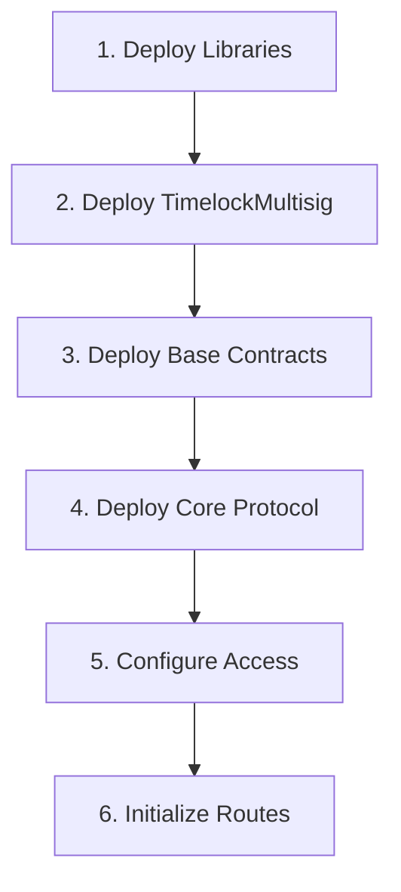

# Testnet Deployment & Testing Plan

## 🎯 Objective
Deploy and thoroughly test the StableRouter protocol on testnets before mainnet launch.

---

## 📋 Phase 1: Pre-Deployment Setup (Week 1)

### 1.1 Testnet Selection
**Primary Testnets:**
- **Sepolia** (Ethereum testnet) - Primary testing
- **Arbitrum Sepolia** - L2 testing  
- **Base Sepolia** - Optimistic rollup testing
- **Fuji** (Avalanche testnet) - Alternative chain testing

**Why these testnets:**
- Active CCTP support on Sepolia
- LayerZero V2 available
- Stargate testnet deployments
- Good faucet availability

### 1.2 Required Test Tokens
```yaml
USDC_TEST:
  - Sepolia: Request from Circle's testnet faucet
  - Arbitrum Sepolia: Bridge from Sepolia
  
USDT_TEST:
  - Deploy mock contracts
  
PYUSD_TEST:
  - Deploy mock OFT contracts
  
ETH_TEST:
  - Sepolia: https://sepoliafaucet.com
  - Arbitrum: Bridge from Sepolia
```

### 1.3 External Protocol Addresses
```solidity
// Sepolia Testnet
CCTP_TOKEN_MESSENGER = "0x9f3B8679c73C2Fef8b59B4f3444d4e156fb70AA5"
CCTP_MESSAGE_TRANSMITTER = "0x7865fAfC2db2093669d92c0F33AeEF291086BEFD"
LAYERZERO_ENDPOINT = "0xae92d5aD7583AD66E49A0c67BAd18F6ba52dDDc1"
STARGATE_ROUTER = "0x1d4C2a246311bB9f827F4C768e277FF5787B7D7E"
UNISWAP_V3_ROUTER = "0x3bFA4769FB09eefC5a80d6E87c3B9C650f7Ae48E"

// Arbitrum Sepolia
CCTP_TOKEN_MESSENGER = "0x9f3B8679c73C2Fef8b59B4f3444d4e156fb70AA5"
LAYERZERO_ENDPOINT = "0x6098e96a28E02f27B1e6BD381f870F1C8Bd169d3"
```

---

## 📋 Phase 2: Deployment (Week 1-2)

### 2.1 Deployment Order


### 2.2 Deployment Script
```javascript
// scripts/deploy-testnet.js
const hre = require("hardhat");

async function main() {
  console.log("🚀 Starting Testnet Deployment...");
  
  // 1. Deploy TimelockMultisig (2 day delay for testnet)
  const proposers = [
    "0x...", // Team member 1
    "0x...", // Team member 2
    "0x...", // Team member 3
  ];
  const executors = [
    "0x...", // Executor 1
    "0x...", // Executor 2
  ];
  
  const TimelockMultisig = await hre.ethers.getContractFactory("TimelockMultisig");
  const timelock = await TimelockMultisig.deploy(
    2 * 24 * 60 * 60, // 2 days
    proposers,
    executors,
    ethers.constants.AddressZero // Renounce admin
  );
  
  // 2. Deploy SwapExecutor
  const SwapExecutor = await hre.ethers.getContractFactory("SwapExecutor");
  const swapExecutor = await SwapExecutor.deploy(UNISWAP_V3_ROUTER);
  
  // 3. Deploy FeeManager
  const FeeManager = await hre.ethers.getContractFactory("FeeManager");
  const feeManager = await FeeManager.deploy(timelock.address);
  
  // 4. Deploy CCTPHookReceiver
  const CCTPHookReceiver = await hre.ethers.getContractFactory("CCTPHookReceiver");
  const hookReceiver = await CCTPHookReceiver.deploy(
    swapExecutor.address,
    CCTP_MESSAGE_TRANSMITTER,
    USDC_TEST_ADDRESS
  );
  
  // 5. Deploy RouteProcessor (UUPS Proxy)
  const RouteProcessor = await hre.ethers.getContractFactory("RouteProcessor");
  const routeProcessor = await upgrades.deployProxy(
    RouteProcessor,
    [
      timelock.address,
      CCTP_TOKEN_MESSENGER,
      CCTP_MESSAGE_TRANSMITTER,
      LAYERZERO_ENDPOINT,
      STARGATE_ROUTER
    ],
    { kind: 'uups' }
  );
  
  // 6. Deploy StableRouter (UUPS Proxy)
  const StableRouter = await hre.ethers.getContractFactory("StableRouter");
  const stableRouter = await upgrades.deployProxy(
    StableRouter,
    [
      routeProcessor.address,
      swapExecutor.address,
      feeManager.address
    ],
    { kind: 'uups' }
  );
  
  // 7. Configure Access Controls
  await feeManager.authorizeCollector(stableRouter.address, true);
  await hookReceiver.setAuthorizedSender(
    0, // Ethereum domain
    ethers.utils.hexZeroPad(routeProcessor.address, 32),
    true
  );
  
  // 8. Transfer Ownership to Timelock
  await swapExecutor.transferOwnership(timelock.address);
  await feeManager.transferOwnership(timelock.address);
  await hookReceiver.transferOwnership(timelock.address);
  await routeProcessor.transferOwnership(timelock.address);
  await stableRouter.transferOwnership(timelock.address);
  
  console.log("✅ Deployment Complete!");
  console.log("Timelock:", timelock.address);
  console.log("StableRouter:", stableRouter.address);
  console.log("RouteProcessor:", routeProcessor.address);
  console.log("SwapExecutor:", swapExecutor.address);
  console.log("FeeManager:", feeManager.address);
  console.log("CCTPHookReceiver:", hookReceiver.address);
}

main().catch(console.error);
```

---

## 📋 Phase 3: Configuration (Week 2)

### 3.1 Token Configuration
```javascript
// Configure USDC
await routeProcessor.configureToken(
  USDC_TEST,
  true,  // isUSDC
  "0x0000000000000000000000000000000000000000", // No OFT
  0      // No Stargate pool
);

// Configure mock USDT
await routeProcessor.configureToken(
  USDT_TEST,
  false,
  "0x0000000000000000000000000000000000000000",
  2      // Stargate pool ID for USDT
);

// Configure mock PYUSD (with OFT)
await routeProcessor.configureToken(
  PYUSD_TEST,
  false,
  PYUSD_OFT_ADDRESS,
  0
);
```

### 3.2 Pool Configuration
```javascript
// Configure Uniswap V3 pools
await swapExecutor.configurePool(
  USDC_TEST,
  USDT_TEST,
  USDC_USDT_POOL,
  DexType.UniswapV3,
  ethers.utils.defaultAbiCoder.encode(["uint24"], [3000]) // 0.3% fee
);
```

### 3.3 Chain Configuration
```javascript
// Set up cross-chain receivers
await routeProcessor.setCCTPHookReceiver(
  421614, // Arbitrum Sepolia
  ARBITRUM_HOOK_RECEIVER
);

await routeProcessor.setDestinationOFTAddress(
  421614,
  PYUSD_TEST,
  ARBITRUM_PYUSD_OFT
);
```

---

## 📋 Phase 4: Testing Scenarios (Week 2-3)

### 4.1 Basic Functionality Tests
```javascript
describe("Testnet Integration Tests", () => {
  
  it("Test 1: USDC → USDC via CCTP", async () => {
    const amount = ethers.utils.parseUnits("100", 6);
    await usdc.approve(stableRouter.address, amount);
    
    await stableRouter.executeRoute({
      sourceToken: USDC_TEST,
      destToken: USDC_TEST,
      amount: amount,
      destChainId: 421614, // Arbitrum Sepolia
      recipient: user.address,
      minAmountOut: amount.mul(99).div(100),
      routeData: "0x"
    });
    
    // Wait for attestation (~15 seconds on testnet)
    // Verify on destination chain
  });
  
  it("Test 2: USDC → USDT with swap", async () => {
    // Test CCTP with hooks
  });
  
  it("Test 3: PYUSD cross-chain via LayerZero", async () => {
    // Test OFT transfer
  });
  
  it("Test 4: Batch operations", async () => {
    // Test batch swaps with deadline
  });
});
```

### 4.2 Security Tests
- **Deadline expiration** - Submit tx with past deadline
- **Slippage protection** - High slippage scenarios
- **Reentrancy attempts** - Malicious callback contracts
- **Access control** - Unauthorized calls
- **Pause mechanism** - Emergency pause/unpause

### 4.3 Multi-sig Tests
- Propose upgrade via timelock
- Wait 2 days
- Execute upgrade
- Verify new implementation

### 4.4 Stress Tests
- Max batch size operations
- Rapid sequential transactions
- High gas price scenarios
- Network congestion simulation

---

## 📋 Phase 5: Monitoring & Validation (Week 3)

### 5.1 Monitoring Setup
```javascript
// scripts/monitor-testnet.js
const ethers = require('ethers');

async function monitorEvents() {
  const provider = new ethers.providers.JsonRpcProvider(SEPOLIA_RPC);
  const router = new ethers.Contract(STABLE_ROUTER, abi, provider);
  
  router.on("RouteInitiated", (user, source, dest, amount, chain, recipient) => {
    console.log(`Route: ${source} → ${dest} on chain ${chain}`);
    console.log(`Amount: ${ethers.utils.formatUnits(amount, 6)}`);
    
    // Track in database
    await saveRoute({user, source, dest, amount, chain, recipient});
  });
  
  router.on("RouteCompleted", (routeId, user, amountOut) => {
    console.log(`✅ Route ${routeId} completed`);
    console.log(`Output: ${ethers.utils.formatUnits(amountOut, 6)}`);
  });
}
```

### 5.2 Verification Checklist
- [ ] All contracts verified on Etherscan
- [ ] Multi-sig properly configured
- [ ] Access controls set correctly
- [ ] Emergency functions tested
- [ ] Cross-chain messages working
- [ ] Swaps executing correctly
- [ ] Fees collecting properly
- [ ] Upgrades functioning

---

## 📋 Phase 6: Performance Testing (Week 3-4)

### 6.1 Gas Optimization Tests
```javascript
// Measure gas usage
const gasUsed = {
  cctp: [],
  layerzero: [],
  stargate: [],
  swaps: []
};

// Run 100 transactions of each type
for(let i = 0; i < 100; i++) {
  const tx = await stableRouter.executeRoute(...);
  const receipt = await tx.wait();
  gasUsed.cctp.push(receipt.gasUsed);
}

console.log("Average gas:", average(gasUsed.cctp));
```

### 6.2 Load Testing
- 10 TPS sustained for 1 hour
- 50 concurrent users
- Multiple chains simultaneously
- Recovery from failures

---

## 📋 Phase 7: Bug Bounty (Week 4)

### 7.1 Testnet Bug Bounty Program
```markdown
## Rewards
- Critical: 1000 USDC
- High: 500 USDC  
- Medium: 200 USDC
- Low: 50 USDC

## Scope
- All deployed contracts
- Cross-chain functionality
- Access control bypasses
- Economic exploits
```

### 7.2 Submission Process
1. Find vulnerability
2. Document steps to reproduce
3. Submit via secure form
4. Team validates within 48h
5. Payout upon confirmation

---

## 🛠️ Tools & Resources

### Development Tools
```bash
# Hardhat Tasks
npx hardhat deploy --network sepolia
npx hardhat verify --network sepolia CONTRACT_ADDRESS
npx hardhat test:integration --network sepolia

# Monitoring
npm run monitor:testnet
npm run dashboard:testnet
```

### Testnet Resources
- **Sepolia Faucet**: https://sepoliafaucet.com
- **CCTP Testnet**: https://developers.circle.com/stablecoin/docs/testnet
- **LayerZero Testnet**: https://layerzero.gitbook.io/docs/technical-reference/testnet
- **Tenderly**: For transaction debugging
- **Etherscan**: For contract verification

### Emergency Contacts
```yaml
On-Call Rotation:
  Primary: +1-XXX-XXX-XXXX
  Secondary: +1-XXX-XXX-XXXX
  
Discord Channel: #testnet-war-room
Telegram: @stablerouter_alerts
```

---

## 📊 Success Metrics

### Week 1-2: Deployment
- ✅ All contracts deployed
- ✅ Multi-sig configured
- ✅ Basic routes working

### Week 2-3: Testing  
- ✅ 100+ successful cross-chain transfers
- ✅ All security tests passed
- ✅ <0.1% failure rate

### Week 3-4: Optimization
- ✅ Gas costs within 10% of estimates
- ✅ 10+ TPS sustained
- ✅ Zero critical bugs found

### Ready for Mainnet When:
- [ ] 2 weeks stable on testnet
- [ ] 1000+ successful transactions
- [ ] All auditor recommendations implemented
- [ ] Team sign-off from 3/5 members
- [ ] Emergency procedures tested

---

## 🚨 Rollback Plan

If critical issues found:
1. **Pause all contracts** immediately
2. **Drain protocol-owned liquidity** to safe wallet
3. **Notify users** via all channels
4. **Fix issues** and redeploy
5. **Fresh audit** of fixes
6. **Restart testing** from Phase 4

---

## 📅 Timeline Summary

**Total Duration: 4 weeks**

```
Week 1: Setup & Initial Deployment
Week 2: Configuration & Basic Testing
Week 3: Security & Stress Testing
Week 4: Bug Bounty & Final Validation
Week 5: Mainnet Deployment (if ready)
```

**Go/No-Go Decision**: End of Week 4

---

## Next Steps

1. **Immediate Actions:**
   - [ ] Set up testnet wallets
   - [ ] Request testnet tokens
   - [ ] Configure deployment scripts
   - [ ] Set up monitoring infrastructure

2. **Team Assignments:**
   - DevOps: Deployment & monitoring
   - Security: Penetration testing
   - QA: Integration testing
   - Product: User acceptance testing

3. **Communication:**
   - Daily standups during deployment
   - Weekly progress reports
   - Immediate alerts for blockers

Ready to begin deployment? 🚀