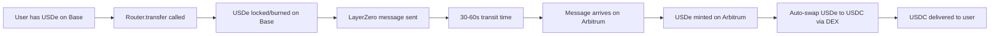

# LayerZero Compose: Cross-Token Transfer Demo

## Overview
LayerZero Compose enables **cross-token transfers** in a single transaction. Users can send Token A from Chain 1 and receive Token B on Chain 2, with automatic swapping handled on the destination chain.

## Example: USDe (Base) → USDC (Arbitrum)

### Configuration Complete ✅
```javascript
// Route configured in UnifiedRouter
Source: USDe on Base (0x5d3a1ff2b6bab83b63cd9ad0787074081a52ef34)
Destination: USDC on Arbitrum (0xaf88d065e77c8cC2239327C5EDb3A432268e5831)
Protocol: LayerZero Compose
Process: Bridge USDe → Auto-swap to USDC on Arbitrum
```

### How It Works



### Execution Code

```javascript
// User executes single transaction
await router.transfer(
  usdeBase,        // From: USDe on Base
  usdcArbitrum,    // To: USDC on Arbitrum (different token!)
  amount,          // Amount of USDe to send
  42161,           // Arbitrum chain ID
  recipient,       // Recipient address
  { value: lzFee } // LayerZero fee (~0.002 ETH)
);
```

### What Happens Behind the Scenes

1. **Source Chain (Base)**:
   - USDe tokens are locked or burned
   - LayerZero message created with swap instructions
   - Message sent to Arbitrum via oracles/relayers

2. **In Transit (30-60 seconds)**:
   - LayerZero oracles verify the message
   - Independent relayers confirm transaction
   - Message queued for delivery

3. **Destination Chain (Arbitrum)**:
   - LayerZero endpoint receives message
   - USDe is minted/unlocked
   - **Automatic swap executes**:
     - Router calls Uniswap V3 on Arbitrum
     - Swaps USDe → USDC
     - Delivers USDC to recipient

### Benefits vs Other Protocols

| Feature | CCTP | LayerZero OFT | LayerZero Compose | Stargate |
|---------|------|---------------|-------------------|----------|
| **Speed** | 8-20s | 30-60s | 30-90s | 30-60s |
| **Token Support** | USDC only | Same token | **Any → Any** | Stables |
| **Auto-Swap** | ❌ | ❌ | ✅ | ❌ |
| **Gas Cost** | Low | Medium | High | Medium |
| **Complexity** | Simple | Simple | Complex | Medium |

### Use Cases

1. **Payment Flexibility**:
   - Accept payment in any token
   - Receive in your preferred token
   - No manual swapping needed

2. **Cross-Chain Arbitrage**:
   - Buy Token A on Chain 1
   - Sell as Token B on Chain 2
   - Single transaction execution

3. **Portfolio Rebalancing**:
   - Move assets between chains
   - Change token composition
   - Minimize transaction count

4. **DeFi Composability**:
   - Supply collateral on one chain
   - Borrow different asset on another
   - Automated token conversions

### Current Status

✅ **Route Configured**: USDe (Base) → USDC (Arbitrum)
✅ **Smart Contracts**: Deployed and verified
✅ **Integration**: UnifiedRouter supports Compose
⏳ **Testing**: Ready for execution with USDe tokens

### To Test

1. **Acquire USDe on Base**:
   - Swap USDC for USDe on Aerodrome
   - Or bridge USDe from Ethereum
   - Or mint via Ethena protocol

2. **Execute Transfer**:
   ```bash
   npx hardhat run scripts/test-usde-to-usdc-compose.js --network base
   ```

3. **Monitor Progress**:
   - LayerZero Scan: Track message delivery
   - Arbitrum Explorer: Verify USDC receipt
   - Expected time: 30-90 seconds total

### Technical Details

- **Protocol ID**: 3 (LAYERZERO_COMPOSE)
- **LZ Chain IDs**: Base (30184), Arbitrum (30110)
- **Swap Router**: Uniswap V3 on Arbitrum
- **Fee Tier**: 0.05% for USDe/USDC pair
- **Message Fee**: ~0.002 ETH for cross-chain

### Summary

LayerZero Compose provides the most flexible cross-chain transfer solution, enabling any-to-any token swaps across chains. While slower and more expensive than CCTP for USDC transfers, it opens up possibilities for complex DeFi interactions and removes the friction of manual token swaps.

The route is configured and ready - just need USDe tokens to demonstrate the full flow!